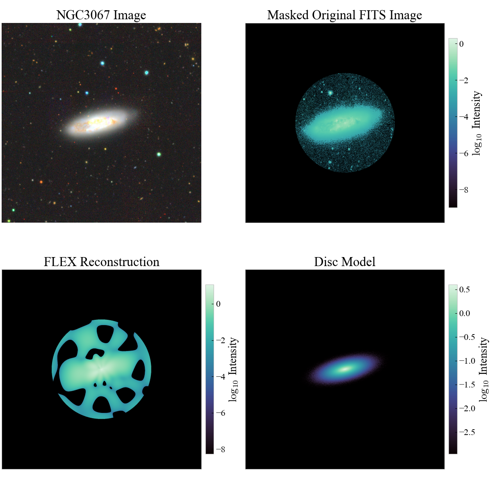

# Galaxy-Morphology

**FLEX-enabled Galaxy Inclination & Morphology Calculator**

This repository contains tools and workflows to measure the inclination and other morphological parameters of disc galaxies from imaging data. The methods follow the Fourier–Laguerre (FLEX)–based description in Martinez et al. (2025), enabling a robust, model-based extraction of:

- Inclination via a dimensionless metric $\eta$
- Position angle
- Scale Length

The code is designed to be used both as a Python package and through Jupyter notebooks for exploratory analysis and figure generation.

Applying the methods outlined in [`HowTo.ipynb`](SGA_catalogue/HowTo.ipynb) and [`PaperPlots.ipynb`](PaperPlots.ipynb), you can compare any .fits galaxy image and analyse its orientation visually producing a graph similar to the figure below. Applying `galaxymorphology` to a single file or a set of files reproduces a table of corresponding measurements.




The repository is sectioned as follows:

[`Notebooks`](notebooks/) folder contains ipynb files which were used in analysis during the project

[`SGA_catalogue`](SGA_catalogue) folder contains intstructions and sample data for reproducible results comparible to those which are published

[`PlotsPaper`](PlotsPaper) folder contains the relevant plots for the paper

[`PaperPlots`](PaperPlots.ipynb) file contains instructions on producing the small sample analysis and disc generation

[`src`](src) folder contains the `galaxymorphology` function


---

## Features

- Measurement of disc galaxy inclinations and position angles from imaging data by use of FLEX and a defined metric 
- Support for generating and regenerating publication-grade plots (e.g. inclination comparisons, error distributions)
- Applying a DiscModel to simulate a disc galay of any inclination and position angle
- FLEX / Fourier–Laguerre based fitting framework, following Martinez et al. (2025)  
- Notebooks including analysis on inclination inversion relations  

---

## Installation

1. **Clone the repository**

```bash
git clone https://github.com/ObservationalExpansions/Galaxy-Morphology.git
cd Galaxy-Morphology
***what happens next to find galaxy morphology function????????
pip install .

```

